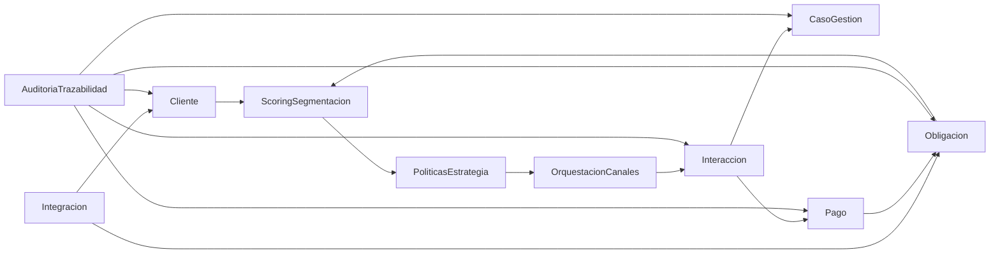

# Arquitectura DDD de dominios (v1)

Este documento define la arquitectura base de dominios para la solucion de recuperacion de cartera.

## 1. Bounded Contexts

### Core (corazon del negocio)
- `Cliente`
- `Obligacion`
- `Interaccion`
- `CasoGestion`
- `Pago`

### Soporte (habilitan decisiones y ejecucion)
- `PoliticasEstrategia`
- `ScoringSegmentacion`
- `OrquestacionCanales`

### Transversales (plataforma y control)
- `Integracion`
- `AuditoriaTrazabilidad`
- `IdentidadAcceso` (ya existe en `security/auth`)

## 2. Context Map

## 3. Estructura por contexto

Cada contexto usa el mismo patron:

- `domain/model`: entidades, agregados y value objects.
- `domain/repository`: contratos del dominio (sin JPA).
- `domain/service`: reglas de dominio que no caben en una entidad.
- `application/service`: casos de uso (orquestan dominio y repositorios).
- `application/dto`: request/response para casos de uso.
- `infrastructure/persistence`: adaptadores JPA, mapeadores, queries.
- `infrastructure/web`: controladores REST.

## 4. Agregados raiz definidos en v1

- `Cliente`: datos de contacto y consentimiento por canal.
- `Obligacion`: saldo, mora, estado y reglas de actualizacion financiera.
- `Interaccion`: intento de contacto y resultado por canal.
- `CasoGestion`: cola, prioridad, estado, SLA y decisiones del asesor.
- `Pago`: transaccion, referencia, estado y conciliacion.

## 5. Reglas de acoplamiento

- Un contexto no persiste directamente entidades de otro contexto.
- Las referencias entre contextos se hacen por identificadores (`Long`, `String`) y eventos.
- `OrquestacionCanales` no cambia saldo directamente; solo registra resultados de contacto.
- Solo `Pago` cambia estado financiero y luego notifica a `Obligacion`/`CasoGestion`.

## 6. Eventos de negocio recomendados

- `ClienteActualizado`
- `ObligacionEnMoraDetectada`
- `ScoreCalculado`
- `EstrategiaDefinida`
- `InteraccionRegistrada`
- `CasoDesbordadoAAsesor`
- `PagoConfirmado`
- `CasoCerrado`

## 7. Orden de construccion recomendado

1. Implementar entidades y repositorios del Core (`Cliente`, `Obligacion`, `Interaccion`, `CasoGestion`, `Pago`).
2. Implementar casos de uso base en capa `application`.
3. Implementar adaptadores JPA y endpoints REST por contexto.
4. Integrar `ScoringSegmentacion` y `PoliticasEstrategia`.
5. Integrar `OrquestacionCanales` (n8n) y callbacks.
6. Endurecer auditoria, observabilidad y cumplimiento regulatorio.

