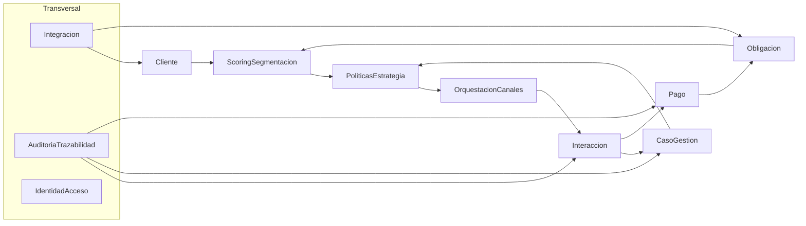
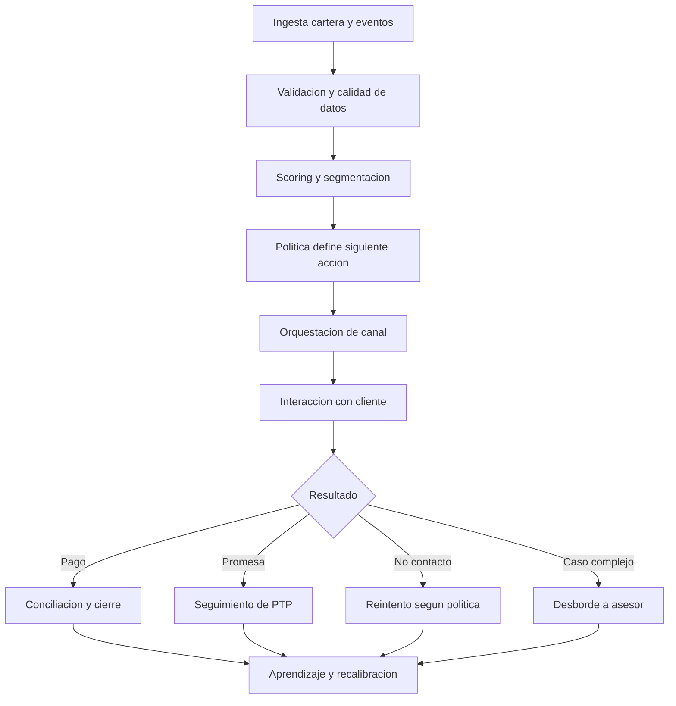
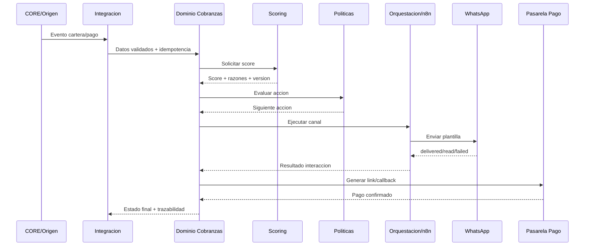

# Plataforma de Recuperación de Cartera - ROADMAP COMPLETO

> Documento de trabajo tecnico/funcional para ejecutar el proyecto por pasos, aprender el dominio de cobranza y reducir riesgo de implementacion.
> 
> **Nota importante:** este documento orienta cumplimiento y controles. No reemplaza concepto juridico formal.

## 1) Objetivo de este roadmap

- Construir la solucion completa en 5 entregas, con arquitectura DDD sobre Spring Boot.
- Definir una decision de IA para scoring que sea auditable y viable para Colombia.
- Incluir una guia de aprendizaje paso a paso para n8n, WhatsApp Business e integracion IA.
- Dar contexto de negocio (sector financiero/cartera) para alguien que inicia desde cero.

## 2) Decision de IA para scoring (decidida)

### Decision recomendada

**IA principal para scoring: XGBoost + SHAP (explicabilidad) + fallback de reglas de negocio.**

### Por que esta decision

- Buen equilibrio entre desempeno y explicabilidad.
- Permite auditoria: se puede explicar por que una obligacion recibio cierto score.
- Facil de operar con ciclos de retraining por lotes (diario/semanal).
- Se integra bien con una arquitectura de eventos y con controles regulatorios.

### Lo que NO haremos para scoring principal

- No usar LLM como modelo principal de score crediticio/cobranza.
- LLM solo se puede usar como apoyo (resumen de caso, sugerencia de guion, QA interno), nunca como decision final unica.

### Estrategia de modelos (Champion/Challenger)

- **Champion inicial:** Regresion logistica + reglas (arranque rapido y controlado).
- **Champion objetivo:** XGBoost con SHAP.
- **Challenger:** LightGBM o CatBoost (comparacion periodica).
- **Fallback operativo:** motor de reglas si el servicio IA falla.

---

## 3) Dominios DDD y bounded contexts (version inicial)

Tus dominios identificados son correctos, pero deben complementarse.

### Contextos core

1. `Cliente`
2. `Obligacion`
3. `Interaccion`
4. `CasoGestion`
5. `Pago`

### Contextos de soporte necesarios

6. `PoliticasEstrategia` (ventanas, frecuencia, mejor siguiente accion)
7. `ScoringSegmentacion` (modelo, score, version, razones)
8. `OrquestacionCanales` (SMS, WhatsApp, email, voz; o via n8n)
9. `Integracion` (API, batch, idempotencia, staging)
10. `AuditoriaTrazabilidad` (bitacora funcional y tecnica)
11. `IdentidadAcceso` (JWT/OAuth2 ya integrado)

### Context map (alto nivel)

---

## 4) Roadmap en 5 entregas (para avanzar rapido)

## Entrega 1 - Fundaciones del dominio y cumplimiento minimo

**Meta:** tener base DDD + datos + seguridad + reglas minimas de cumplimiento.

- Definir lenguaje ubicuo y glosario del negocio.
- Congelar bounded contexts y contratos internos (comandos/eventos).
- Normalizar modelo de datos base (cliente, obligacion, interaccion, caso, pago, catalogos, auditoria).
- Implementar validaciones de contacto por canal (consentimiento, horario, frecuencia).
- Dejar OAuth2/JWT operativo con roles: admin, supervisor, asesor, auditor, integracion.

**Entregables:**
- Mapa de contextos y eventos V1.
- DDL unico de base de datos y diccionario de datos V1.
- Matriz legal-control V1.
- APIs internas base (sin canales externos aun).

**DoD (Definition of Done):**
- Se crea un caso con trazabilidad completa desde obligacion.
- Se rechaza contacto fuera de reglas parametrizadas.

---

## Entrega 2 - Motor de estrategia + scoring V1

**Meta:** priorizar cartera y decidir siguiente accion de forma auditable.

- Construir pipeline de features (dias mora, saldo, historico pagos, efectividad canal, promesas incumplidas).
- Entrenar Champion inicial (regresion + reglas) y luego XGBoost.
- Exponer `score`, `segmento` y `razones principales`.
- Implementar fallback automatico a reglas.
- Versionar modelos/politicas y registrar evidencia de cada decision.

**Entregables:**
- Servicio `ScoringSegmentacion` V1.
- Repositorio de modelos/versiones.
- Tablero tecnico de metricas (AUC, KS, precision top deciles, drift).

**DoD:**
- Cada decision de contacto muestra score + version de modelo + timestamp + razon.

---

## Entrega 3 - Orquestacion omnicanal con n8n (MVP)

**Meta:** ejecutar estrategias reales por canales con trazabilidad.

- Implementar `OrquestacionCanales` desacoplado del dominio (adapter/infrastructure).
- Integrar n8n para flujos de envio y callbacks.
- Activar primer canal productivo (recomendado: WhatsApp Business Cloud API) + email como respaldo.
- Registrar eventos de entrega/lectura/error y actualizacion de `Interaccion`.
- Activar desborde a asesor cuando regla o resultado lo exija.

**Entregables:**
- Workflows n8n versionados.
- Adaptadores API para canal(es).
- Politicas de reintento, idempotencia y correlacion.

**DoD:**
- De estrategia a interaccion ejecutada, con estados de entrega trazables end-to-end.

---

## Entrega 4 - Pago, conciliacion y cierre de ciclo

**Meta:** convertir contacto en recaudo conciliado con cierre automatico.

- Integrar proveedor de link de pago/pasarela.
- Generar links firmados con vigencia y metadatos de conciliacion.
- Consumir callback de pago y actualizar `Pago`, `CasoGestion` y `Obligacion`.
- Manejar escenarios: pago total, parcial, vencimiento link, reproceso.
- Reporte operativo por lote/transaccion/canal.

**Entregables:**
- Modulo `Pago` + conciliacion V1.
- Reportes de recuperacion y efectividad por estrategia.

**DoD:**
- Flujo completo: mensaje con link -> pago confirmado -> conciliacion -> cierre/pausa estrategia.

---

## Entrega 5 - Gobierno, escalamiento y salida a produccion

**Meta:** dejar plataforma auditable, monitoreada y lista para operacion estable.

- Endurecer observabilidad (logs, metricas, trazas, alertas).
- Implementar monitoreo de drift y degradacion del scoring.
- Completar matrices de riesgos, continuidad, backup, RTO/RPO.
- Ejecutar SIT/UAT y evidencias de cumplimiento.
- Preparar runbooks, manual operativo y plan de estabilizacion.

**Entregables:**
- Paquete de salida a produccion.
- Manuales y evidencias UAT/SIT.
- Plan de mejora continua (ciclo mensual).

**DoD:**
- KPIs operativos y de cumplimiento visibles en tablero.
- Operacion estable con bitacora exportable para auditoria.

---

## 5) Guia paso a paso de aprendizaje (n8n, WhatsApp, IA)

## 5.1 Ruta de aprendizaje recomendada (orden)

1. Fundamentos de cobranza + regulacion (1 semana)
2. DDD practico en tu proyecto (1 semana)
3. n8n basico y flujos con webhook (1 semana)
4. WhatsApp Business Cloud API (1 a 2 semanas)
5. IA scoring (2 semanas)
6. Integracion todo-en-uno y pruebas (1 semana)

## 5.2 n8n desde cero (paso a paso)

### Paso 1: conceptos minimos

- Workflow
- Trigger
- Node
- Credential
- Execution log
- Error workflow

### Paso 2: primer flujo real

- Trigger webhook `POST /events/contact-strategy`
- Validar payload (`customerId`, `obligationId`, `channel`, `templateId`)
- Enrutar por canal (switch)
- Simular envio (HTTP Request a mock)
- Guardar resultado (callback al backend)

### Paso 3: buenas practicas desde el inicio

- Idempotency key por mensaje.
- Correlation id end-to-end.
- Reintentos con backoff.
- Dead-letter (errores no recuperables).
- Versionado de workflow (v1, v2...).

### Paso 4: seguridad n8n

- Variables por ambiente.
- Secrets en gestor seguro.
- IP allowlist para webhooks.
- Firma de callbacks.

## 5.3 WhatsApp Business (paso a paso)

### Opcion recomendada para MVP

**Meta WhatsApp Cloud API** (oficial, menor lock-in).

### Camino de aprendizaje

1. Crear Business Manager y verificar negocio.
2. Crear app en Meta for Developers.
3. Configurar numero y token de acceso.
4. Crear/aprobar plantillas (utilidad, autenticacion, marketing segun politica).
5. Enviar mensajes de prueba.
6. Configurar webhooks de estados (sent, delivered, read, failed).
7. Conectar n8n para orquestar envio y recepción de eventos.
8. Integrar con backend para persistir en `Interaccion`.

### Reglas operativas clave

- No enviar fuera de ventanas autorizadas.
- Respetar consentimiento por canal.
- Plantillas con lenguaje claro y no agresivo.
- Registrar evidencia de envio y respuesta.

## 5.4 IA de scoring (paso a paso)

### Paso 1: definir objetivo y etiqueta

- Objetivo inicial sugerido: `probabilidad_de_pago_en_30_dias`.
- Etiqueta binaria para MVP: pago/no pago en ventana.

### Paso 2: construir dataset

- Periodo historico minimo sugerido: 12 meses.
- Separar train/validation/test por tiempo (no aleatorio puro).
- Evitar leakage (variables del futuro).

### Paso 3: baseline simple

- Reglas + regresion logistica.
- Medir AUC, KS, precision top decil.

### Paso 4: modelo objetivo

- XGBoost con tuning controlado.
- Calibrar probabilidad.
- Explicabilidad con SHAP.

### Paso 5: despliegue y monitoreo

- Publicar endpoint de scoring.
- Registrar version del modelo y features.
- Monitorear drift de datos y de desempeno.
- Fallback a reglas ante falla.

---

## 6) Marco legal Colombia llevado a controles tecnicos

> Validar siempre con equipo juridico/compliance interno.

| Norma | Que exige en la practica | Control tecnico recomendado |
|---|---|---|
| Ley 2300 de 2023 | Horarios/frecuencia/canales de cobranza | Motor de politicas con ventanas, limites y exclusiones por cliente |
| Ley 1266 de 2008 | Habeas data financiero y trazabilidad | Bitacora de origen, uso y actualizacion de informacion |
| Ley 2157 de 2021 | Reglas complementarias de informacion crediticia | Flujos de correccion/actualizacion de datos y evidencias |
| Ley 1581 de 2012 | Proteccion de datos personales | Consentimiento por canal, minimizacion, cifrado, control de acceso |
| Decreto 1377/2013 y 1074/2015 | Reglamentacion de privacidad | Politicas de tratamiento, finalidades y derechos del titular |
| Circular 048/2008 (SFC) | Buenas practicas de cobranza prejudicial | Guiones, auditoria de contacto, evidencia y trato no abusivo |

Controles minimos obligatorios desde MVP:

- Consentimiento por canal y finalidad.
- Restriccion de horario y frecuencia por politica.
- Auditoria inalterable de decisiones y contactos.
- Explicacion de score/segmento en lenguaje de negocio.
- Mecanismo de atencion de solicitudes del titular (habeas data).

---

## 7) Explicacion del negocio bancario/cobranzas para principiantes

### Conceptos basicos

- **Cartera:** conjunto de obligaciones activas.
- **Mora:** atraso en pago frente a fecha pactada.
- **Cobranza preventiva:** antes del vencimiento o mora temprana.
- **Cobranza administrativa/prejuridica:** fases de mayor severidad antes de cobro judicial.
- **Promesa de pago (PTP):** compromiso de pago en fecha futura.
- **Normalizacion:** obligacion vuelve a estado al dia o acuerda plan valido.

### Flujo simplificado del negocio

### Diagrama de secuencia (tecnico)

---

## 8) Plan de estudio semanal (modo profesor personalizado)

## Semana 1-2

- Entender glosario de cobranza y marco legal.
- Revisar tablas del dominio y eventos clave.
- Ejercicio: mapear 10 casos reales de negocio a entidades/eventos.

## Semana 3-4

- Dominar DDD tactico: agregados, invariantes, servicios de dominio.
- Ejercicio: definir comandos/eventos por `CasoGestion` y `Interaccion`.

## Semana 5-6

- Aprender n8n con 3 workflows: envio, callback, retry.
- Ejercicio: simular 100 mensajes con distintos resultados.

## Semana 7-8

- Integrar WhatsApp Cloud API y plantillas.
- Ejercicio: medir entrega/lectura/no contacto y actualizar casos.

## Semana 9-10

- Entrenar scoring V1 (logistica + XGBoost).
- Ejercicio: comparar Champion vs Challenger y documentar explicabilidad.

## Semana 11-12

- Pruebas SIT/UAT + auditoria + salida controlada.
- Ejercicio: ejecutar flujo E2E completo en ambiente de pruebas.

---

## 9) Backlog priorizado por valor y riesgo

1. Politicas de cumplimiento (horario/frecuencia/consentimiento)
2. Trazabilidad y auditoria E2E
3. Scoring V1 con explicabilidad
4. WhatsApp + n8n con callbacks
5. Pago y conciliacion automatica
6. Monitoreo de drift y mejora continua

---

## 10) Riesgos principales y mitigacion

- **Riesgo legal:** contacto fuera de politica -> mitigar con control preventivo en motor de reglas.
- **Riesgo de datos:** mala calidad de insumos -> mitigar con staging, validaciones y reproceso.
- **Riesgo de IA:** modelo opaco o inestable -> mitigar con SHAP, versionado, drift y fallback.
- **Riesgo operativo:** fallas de canal -> mitigar con retry, canal alterno y cola manual.
- **Riesgo de adopcion:** curva de aprendizaje -> mitigar con plan semanal y practicas guiadas.

---

## 11) Checklist de inicio (proxima accion)

- [ ] Aprobar este roadmap y la decision de IA.
- [ ] Cerrar diccionario de datos V1 y eventos V1.
- [ ] Priorizar historias de Entrega 1.
- [ ] Definir proveedor inicial de WhatsApp (Cloud API/BSP).
- [ ] Levantar ambiente de n8n para laboratorio.
- [ ] Definir responsables: negocio, datos, backend, integracion, compliance.

